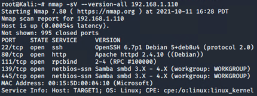
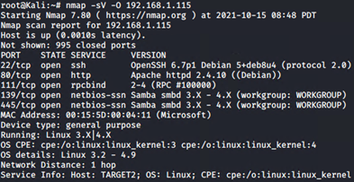
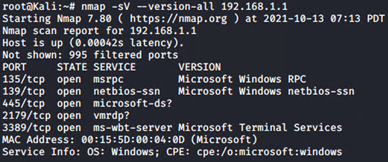
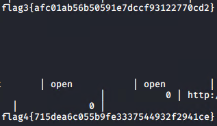
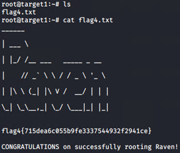
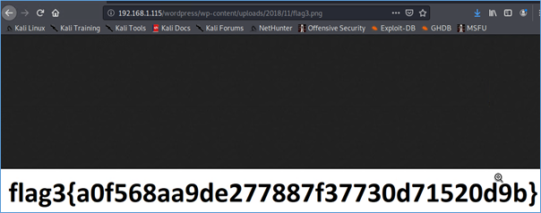

# Red Team: Summary of Operations

## Table of Contents
- Exposed Services
- Critical Vulnerabilities
- Exploitation

### Exposed Services
#### Nmap scan results for each machine reveal the below services and OS details:

Target 1
```bash
$ nmap -sV --version-all 192.168.1.110
```


Target 2
```bash
$ nmap -sV -O 192.168.1.115
```


ELK Server
```bash
$ nmap -sV --version-all 192.168.1.100
```


Capstone
```bash
$ nmap -sV --version-all 192.168.1.105
```
 

Kali
```bash
$ nmap -sV --version-all 192.168.1.90
```


NAT Switch
```bash
$ nmap -sV --version-all 192.168.1.1
```


#### This scan identifies the services below as potential points of entry for Targets 1 and 2:

**Target 1**
| PORT     | STATE      | SERVICE    | VERSION                                      |
|----------|------------|------------|----------------------------------------------|
| 22/tcp   | open       | ssh        | OpenSSH 6.7p1 Debian 5+deb8u4 (protocol 2.0) |
| 80/tcp   | open       | http       | Apache httpd 2.4.10 (Debian)                 |

**Target 2**
| PORT     | STATE      | SERVICE    | VERSION                                      |
|----------|------------|------------|----------------------------------------------|
| 22/tcp   | open       | ssh        | OpenSSH 6.7p1 Debian 5+deb8u4 (protocol 2.0) |
| 80/tcp   | open       | http       | Apache httpd 2.4.10 (Debian)                 |

#### The following vulnerabilities were identified on Target 1:

1. Exposure of Information through Directory Listing (CWE-548)
  - Severity: Low\


2. Weak Password Requirements (CWE-521)
  - Severity: High\


3. Improper Access Control (CWE-284)
  - Severity: High\


4. Improper Privilege Management (CWE-269)
  - Severity: High\


#### In addition to the vulnerabilites above, these vulnerabilities were exploited on Target 2:
1. Remote Code Execution (CVE-2016-10033)
- Severity: High\
\
\
\


2. Command Injection (CWE-77)
- Severity: High\
TODO: INSERT SCREENSHOTS HERE

### Exploitation
#### The Red Team was able to penetrate Target 1 and retrieve the following confidential data:
- `flag1.txt`: _b9bbcb33e11b80be759c4e844862482d_
  - **Exploit Used: _CWE-548: Exposure of Information through Directory Listing_**
  - _Command: '''bash $ nano /var/www/html/service.html_ '''


- `flag2.txt`: _fc3fd58dcdad9ab23faca6e9a36e581c_
  - **Exploit Used: _CWE-521: Weak Password Requirements_**
  - _Command: $ cat /var/www/flag2.txt_\


- `flag3.txt`: _afc01ab56b50591e7dccf93122770cd2_
  - **Exploit Used: _CWE-284: Improper Access Control_**
  - _Command: $ mysql> SELECT * FROM wp_posts;_


- `flag4.txt`: _715dea6c055b9fe3337544932f2941ce_
  - **Exploit Used: _CWE-269: Improper Privilege Management**
  - _Command: $ sudo python -c 'import pty;pty.spawn("bin/bash")'_



#### The team also penetrated `Target 2` and retrieved additional confidential data:
- `flag1.txt`: _a2c1f66d2b8051bd3a5874b5b6e43e21_
  - **Exploit Used: _TODO: Identify the exploit used_**
  - _URL: 192.168.1.115/vendor/PATH_


- `flag2.txt`: _6a8ed560f0b5358ecf844108048eb337_
  - **Exploit Used: _TODO: Identify the exploit used_**
  - _Command: $ cat /var/www/flag2.txt_


- `flag3.txt`: _a0f568aa9de277887f37730d71520d9b_
  - **Exploit Used: _TODO: Identify the exploit used_**
  - _URL: 192.168.1.115/wordpress/wp-content/uploads/2018/11/flag3.png_
